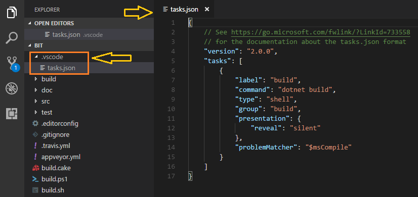
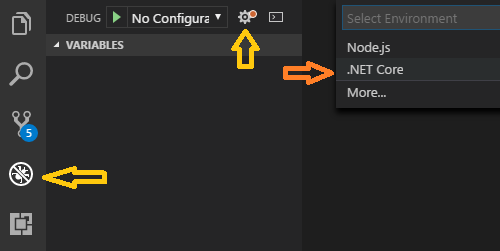
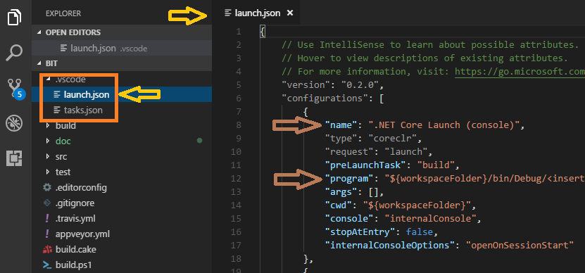

Configurando um ambiente Visual Studio Code no Windows
======================================================

Este pequeno tutorial pretende mostrar como você configura um ambiente para desenvolver o __E5R.Tools.Bit__ com [Visual Studio Code][vscode] no Windows.

## Pré-requisitos

1. [Windows 10][windows10]
2. [PowerShell][powershell]
3. [Visual Studio Code][vscode]
4. [C# para Visual Studio Code][vscode-csharp]
5. Conexão ativa com a Internet

## Etapas de configuração

Considerando que você já adquiriu o código do __E5R.Tools.Bit__ ou por download,
ou por outro meio que foi disponibilizado.

### Instale o Visual Studio Code

Siga as instruções em https://code.visualstudio.com/docs/setup/windows.

### Instale a extensão C#

Siga as instruções em https://marketplace.visualstudio.com/items?itemName=ms-vscode.csharp.

### Configure os componentes .NET e inicie o VSCode:

Em uma sessão do [PowerShell][powershell] execute o script de bootstrap abaixo
para garantir a instalação dos componentes [.NET Core][dotnet] e [Cake][cake] nas versões requeridas.

```powershell
.\build.ps1 -Target=Bootstrap
```

> Isso demora um pouco dependendo da velocidade de sua conexão com a internet,
> mas só da primeira vez, nas próximas tende ser bem mais rápido.

Caso você se depare com um erro parecido com esse abaixo:

```
.\build.ps1 : File ...\bit\build.ps1 cannot be loaded because running
scripts is disabled on this system. For more information, see about_Execution_Policies at
https:/go.microsoft.com/fwlink/?LinkID=135170.
At line:1 char:1
+ .\build.ps1
+ ~~~~~~~~~~~
    + CategoryInfo          : SecurityError: (:) [], PSSecurityException
    + FullyQualifiedErrorId : UnauthorizedAccess
```

É porque sua política de execução de scripts não permite a execução de scripts obtidos da
Internet e/ou que não estejam assinados por um certificado digital válido. Então basta
você executar o comando abaixo e tentar o primeiro passo novamente:

```powershell
Set-ExecutionPolicy Bypass CurrentUser

# Executando o primeiro passo novamente
.\build.ps1 -Target=Bootstrap
```

> PS: Nossos scripts ainda não são assinados por um certificado digital. Quem sabe em breve...

Agora, para garantir que você está usando a instalação correta do .NET SDK (a que foi instalada em
`build/.dotnetsdk` no momento em que você executou o comando anterior de bootstrap), nós iremos
configurar a nossa variável de ambiente `PATH` somente na sessão atual do [PowerShell][powershell].

Em seguida abrimos a pasta do nosso projeto no [Visual Studio Code][vscode].

```powershell
$env:Path = (Join-Path (Pwd) "build/.dotnetsdk") + ";${env:Path}"

# Para abrir a pasta atual no Visual Studio Code
code .
```

> PS: Nós usamos a abordagem de sempre instalar uma versão específica do .NET SDK que é necessária
> para o projeto, com uma versão de .NET Runtime compatível com o [Cake][cake] também, mesmo
> se você já tenha uma instalação ativa do .NET SDK na sua máquina. Isso pode parecer um desperdício
> de tempo e espaço (nós também achamos), mas evita problemas com versões incompatíveis, e fazer
> com que isso seja resolvido manualmente por cada um. Dessa forma nós garantimos que você sempre
> trabalhará com a versão adequada para o projeto. (Se quiser ajudar a resolver este problema,
> nós seremos muito gratos - Veja o [Guia de Contribuição para E5R.Tools.Bit][contributing])

### Crie a tarefa de build

Já com o [Visual Studio Code][vscode] aberto, vamos criar as configurações que nos permitirão depurar o __E5R.Tools.Bit__ adequadamente.

1. Pressione `[CTRL + P]` e selecione a opção __"Tasks: Configure Default Build Task"__;


2. Escolha __"Create tasks.json file from template"__;


3. Em seguida escolha a opção corresponente ao __".NET Core ..."__;


4. Por fim, isso criará o aquivo `.vscode/tasks.json`, conforme abaixo:



> __PS:__ Esse diretório (`.vscode`) é ignorado nos _commits_ do git
> para o projeto (veja o arquivo `.gitignore`), por isso cada desenvolvedor deve
> configurá-lo novamente. Isso é também muito importante porque o editor/IDE é
> uma escolha de cada desenvolvedor e não uma restrição do projeto.

### Crie a configuração de depuração

1. Clique no ícone _Debug_ ou pressione `CTRL + Shift + D`;



2. Então clique no ícone _Configure or Fix 'launch.json'_ e escolha a opção _.NET Core_;

3. Isso criará o aquivo `.vscode/launch.json`, conforme abaixo:



Sugerimos remover todas as outras configurações, deixando somente a primeira:
_.NET Core Launch (console)_, e também sugerimos nomeá-la de __E5R.Tools.Bit (Debug)__.

4. Ajuste o valor `program` no `JSON` conforme abaixo:

```json
"program": "${workspaceFolder}/src/E5R.Tools.Bit/bin/Debug/netcoreapp2.0/bit.dll"
```

5. Por fim você deve terminar com um arquivo `.vscode/launch.json` semelhante a este:

```json
{
  "version": "0.2.0",
  "configurations": [
    {
      "name": "E5R.Tools.Bit (Debug)",
      "type": "coreclr",
      "request": "launch",
      "preLaunchTask": "build",
      "program": "${workspaceFolder}/src/E5R.Tools.Bit/bin/Debug/netcoreapp2.0/bit.dll",
      "args": [],
      "cwd": "${workspaceFolder}",
      "console": "internalConsole",
      "stopAtEntry": false,
      "internalConsoleOptions": "openOnSessionStart"
    }
  ]
}
```

Isso deve ser o suficiente para você marcar seu `break point` e rodar o __E5R.Tools.Bit__ em modo de depuração.

Agora é só brincar!

<!-- Links -->

[vscode]: https://github.com/Microsoft/vscode
[windows10]: https://www.microsoft.com/pt-br/windows
[powershell]: https://github.com/PowerShell/PowerShell
[vscode-csharp]: https://github.com/OmniSharp/omnisharp-vscode
[dotnet]: https://dot.net/core
[cake]: https://cakebuild.net
[contributing]: ../contributing.md
